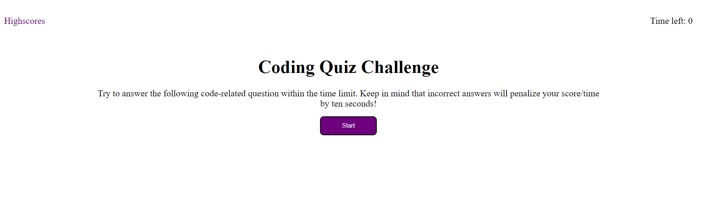
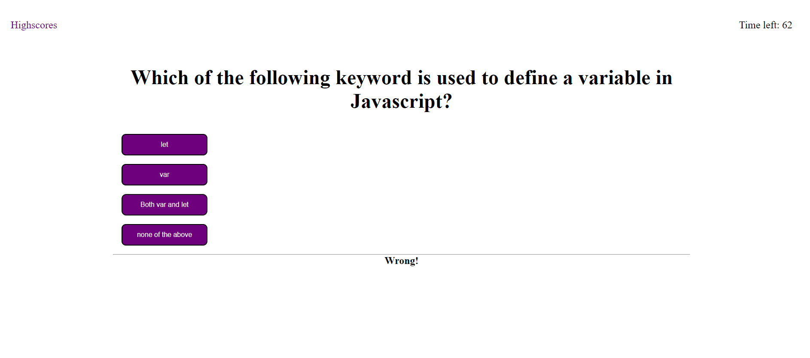
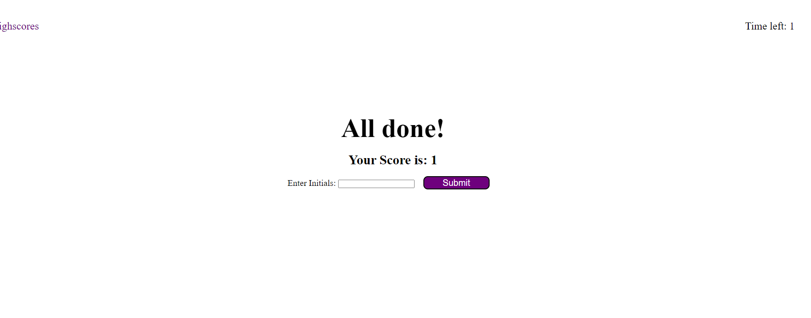
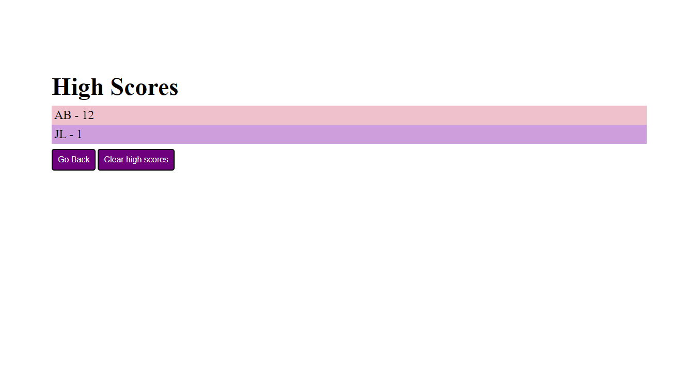

# code-quiz

## Description

This is a code quiz that ask the user questions about Javascript. It is a multiple choice quiz so there will be question prompted and four buttons for each answer. This is also a timed quiz so your score is base off of how much time  you have left when you complete the quiz. You are then able to submit your score the a tracked highscore list on your computer. After submiting the highscore you can then view the list of scores. 

What I learned from this project is the usage of Eventlistener and DOM manipulation in javascript. I was able to listen to user actions via forms and buttons and make it call a function whenever the item has been clicked. I also learned how to create HTML in javascript and select elements in the HTML to manipulate in Javascript. 

## Installation

N/A

## Usage

- open to the page
- click start
- look at the question
- click on the button that matches your answer
- continue until last question or when timer runs out
- Enter intial to submit score to highscore list
- click submit to submit score and move to highscore list
- Click go back to restart the quiz or Clear highscore to clear the list

To add a screenshot, create an `assets/images` folder in your repository and upload your screenshot to it. Then, using the relative file path, add it to your README using the following syntax:

[https://jjackielee.github.io/code-quiz](https://jjackielee.github.io/code-quiz)

## Credits

N/A

## License

N/A

---

## Features

When you click on the Start button you will start a code quiz. After finishing the quiz you will be able to submit your score to a highscore list. You can also access highscore list to view your scores. You can also clear the list of highscores on that page. 

